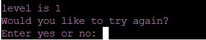

# Nummory 

Nummory is a memory game, in which you have to try to remember as many numbers as possible. It is developed with the intend to help people train their memory and improve their brain. 

##  Table of content
- [How to play](#how-to-play)
- [Frameworks, Libraries & Programs Used](#frameworks,-libraries-&-programs-used)
- [Technologies used](#technologies-used)
- [Features](#features)
- [Testing](#testing)
- [Deployment](#deployment)
- [Credits](#credits)

## How to play

    The goal of the game is to try to remember as many numbers as you can.
    Game:
    1. You get to see a list of numbers
    2. You have 20 seconds to try and memorize the numbers
    3. Try to reproduce all numbers
       -Enter the numbers seperated with whitespace
       -The order is not important
       -For example: 32 5 99 43 is the same as 5 99 32 43
    4. If you have all the numbers correct you
    go a level up and get a extra number to memorize.

## Frameworks, Libraries & Programs Used
- [GitPod](https://gitpod.io/): Gitpod was used as development environment 
- [GitHub](https://github.com/): Github was used to deploy the site and store it  
- random: for generating a random number
- time: used for waiting after user gives nickname and typing effect 
- os: clearing the screen 
- getkey: used for the user to use a keypress to choose, or go to the next step
- gspread: used for the high score list
- google.oauth2.service_account: for high score list 
- tabulate: to create the high score
- colorama: used to add colour to the text
- pyfiglet: used for the ASCII Art Text Banner
- sys: used for the typewriting effect
- Threading: used for the timer during the game that is cancellable. 

## Features
### Start menu
When the game starts you get a start menu and a ASCII Art Text Banner with the name of the game ‘Nummory’ made with numbers. You can make a choice between reading the instructions (press ‘i’) or start the game (press ‘s’). 

### Instructions
The instructions use a typewriter effect so you can follow while reading line by line. It explains the how the game works. 

### nickname
You have to give in a nickname to continue. It can not be empty. 

### Game
When the game itself starts. You receive a menu with a random number (1-99). This is the number you need to remember. 

You have 20 seconds to try to memorise. After this you get a time’s up message and you have to click to go to the next phase.

Then you can enter the numbers. The order of the numbers is not important. The input gets an error if it is not separated by a whitespace or when it is not a number. When the answer is right you go up 1 level and have to remember an extra number. If it is wrong you get feedback. 

### Feedback 
When you give a wrong answer the game ends and receive feedback with the right response. 

### High score 
After the feedback at the end of the game you get the high score list. The high score list is linked with a google sheets and shows the 10 highest scores together with the used nickname.

 

### restart menu
At the end you get the option to restart. Press ‘y’ or ‘n’ to restart the game. 

### other
- Global variables where used in this game to make it easy to store and return the variables in different parts of the game. 
	- 3 variables: 
		- numbers: to store the random generated numbers in 
 		- nickname: to store the chosen nickname in 
		- level: to store the level in 

## Testing 
### Manual testing
- The device was tested in the Heroku mock terminal from code institute.
- Different people were asked to test it and report bugs.  
- Invalid input was tested in the different input boxes.  
- No errors in de pep8online.com validator. 

### Fixed bugs 
- The start menu and restart option was not limited. When nothing or another key was clicked the program went to the following line.  

### Unfixed bugs
- when your time is up you still have to click to be able to give your answer. I wasn't able to get the key press cancelled or mocked. So I added a line that you have to press a key to continue.
- The game is currently not working on mobile devices.  
- the restart function doesn’t work when caps-log is on. It only recognises the lowercase letters. 

## Deployment 
This site was deployed with the code institute mock terminal for Heroku. 

To deploy a page you first go to Heroku dashboard and click op new, create new app. 
Than set the build packs to python and jsnode. 
Lastly in the deploy tab connect the github repository and click on enable automatic deploy. 

The link can be found here: https://nummory.herokuapp.com/

## Credits
### code
- code for ASCII Art Text Banner: https://www.devdungeon.com/content/create-ascii-art-text-banners-python
- code for the typing effect in the instructions: https://www.101computing.net/python-typing-text-effect/
- code for converting list of string to integers: https://www.geeksforgeeks.org/python-converting-all-strings-in-list-to-integers/
- code for building a table: https://www.statology.org/create-table-in-python/

### support 
- Mentor Martina Terlevic for feedback
- Code institute tutor support, tutor Ger. For his time and effort to help try to resolve a bug
- Code institute template and mock terminal
- My brother Joost Vanhoutte for the constructive feedback 
